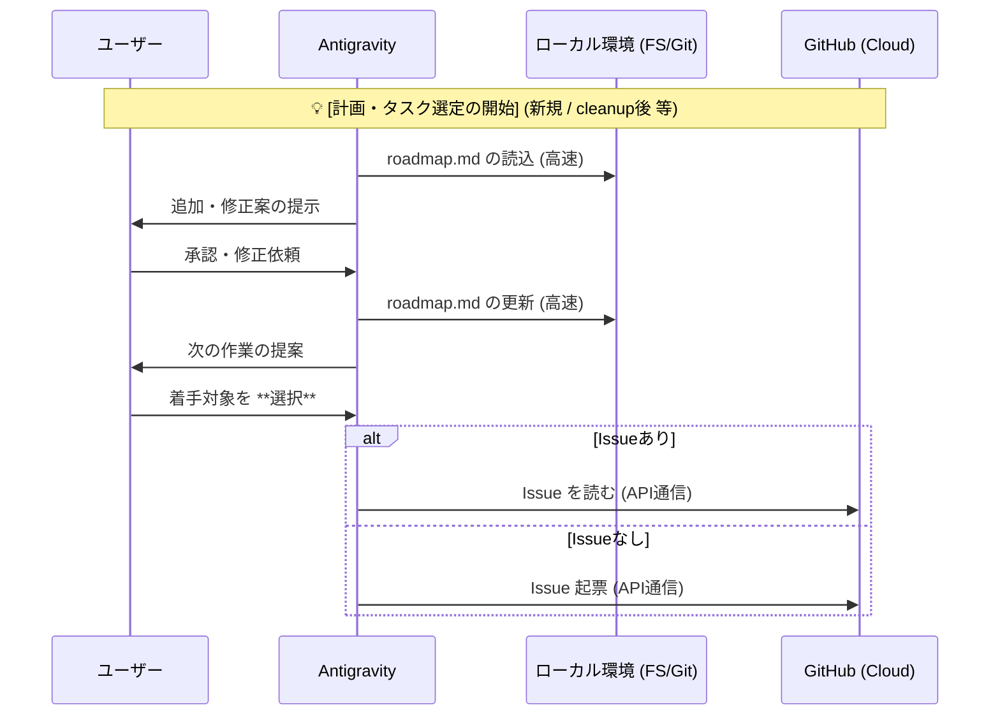
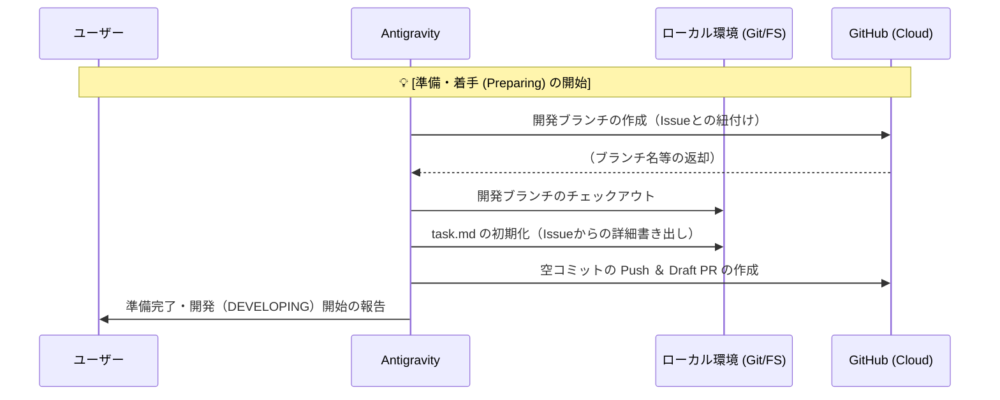
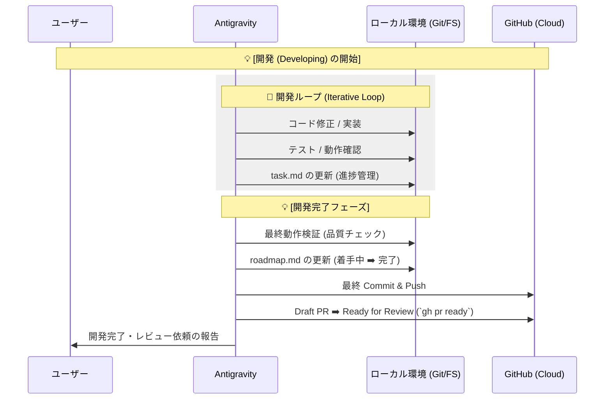
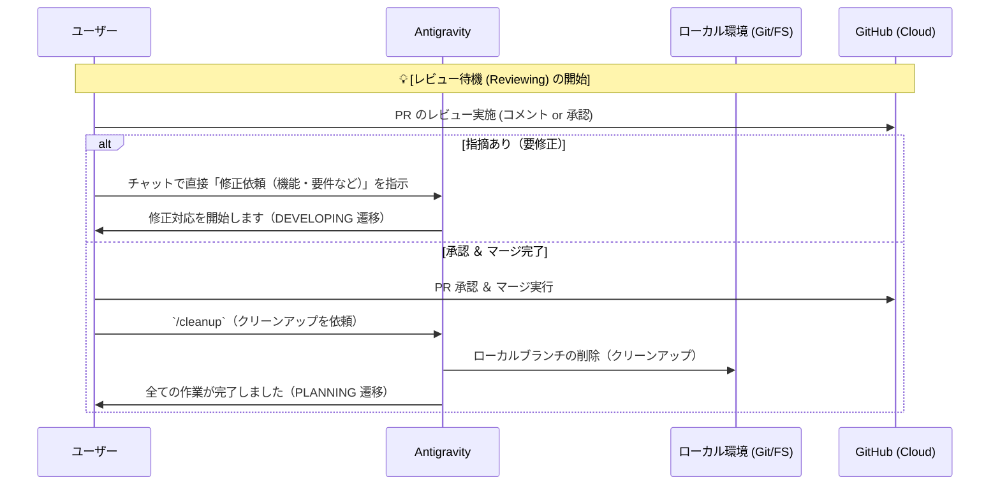

# シーケンス図 (Sequence Diagrams)

アクター（ユーザー・AIエージェント・GitHub）間のメッセージや、各状態（フェーズ）でのキャッチボールを定義します。

---

## 1. PLANNING 状態（計画・タスク選定）

---

## 2. PREPARING 状態（準備）

※ブランチ作成に関して、一貫性担保のため **GitHub 上で先にブランチを発行** しローカルへ引き込む「GitHub-First」を採用します。

---

## 3. DEVELOPING 状態（実装ループ）

---

## 4. REVIEWING 状態（レビュー・後処理）

