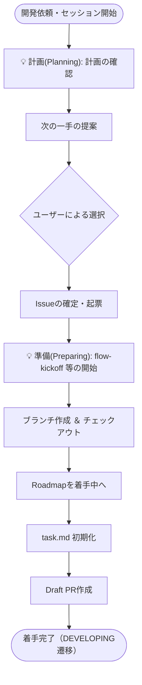
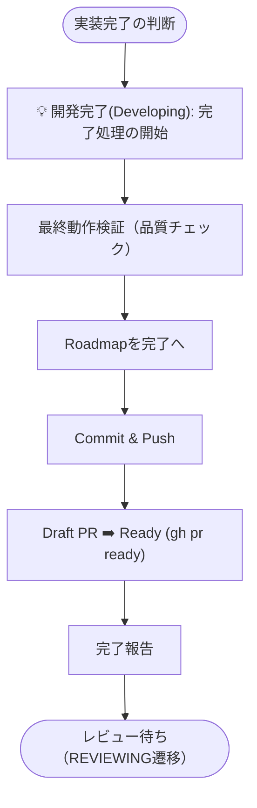

# 詳細実行フロー (Skill Flows)

エージェントが各オーケストレーター（自動化 Skill）を実行する際の内訳・チェックフローのマシナリーを定義します。

---

## 1. 着手フロー (Kickoff Flow)

`flow-kickoff` Skill 等が担う、作業開始時の詳細な論理手順です。

---

## 2. 完了フロー (Wrapup Flow)

`flow-wrapup` Skill 等が担う、品質確保と最終化の詳細な手順です。

