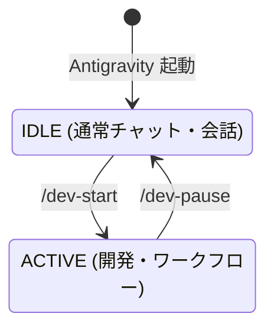
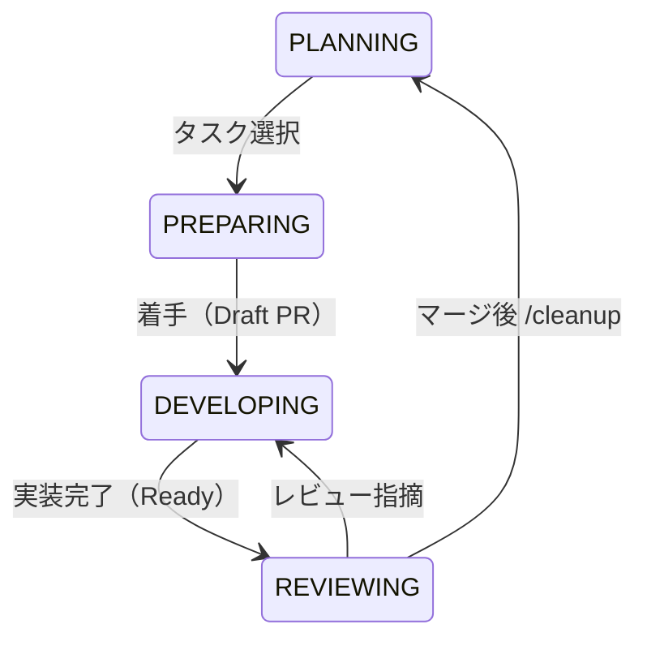

# 状態遷移 (State Machine)

本ドキュメントでは、エージェントの大きな稼働状態（モード）と、その内部での細かいフェーズ（状態）の遷移管理を定義します。

---

## 1. IDLE - ACTIVE 状態

システム起動時、およびコンテキストのロード/セーブによる、大枠のモード切り替えです。

- **状態**
  - **`IDLE`**: 起動直後、または作業一時停止中の、コンテキストが限定された雑談・相談モード。
  - **`ACTIVE`**: `/dev-start` でコンテキストがロードされ、ワークフローに沿って自律稼働する開発モード。

---

## 2. ACTIVE 内部状態 (フェーズ)

ACTIVE モード内では、GitHub flow に準拠した 4 つのフェーズを順番に、あるいはループで遷移します。

- **各状態の概要**
  - **`PLANNING`**: `roadmap.md` を管理し、次に着手するタスク（Issue）を確定させる。
  - **`PREPARING`**: ブランチ作成、`task.md` 初期化、早期 Draft PR 発行までの一括段取り（`flow-kickoff` が担保）。
  - **`DEVELOPING`**: 実装ループ（コード修正 🔁 テスト検証）の自律試行錯誤。
  - **`REVIEWING`**: ユーザーレビュー依頼、およびマージ後の後処理（`/cleanup`）。
