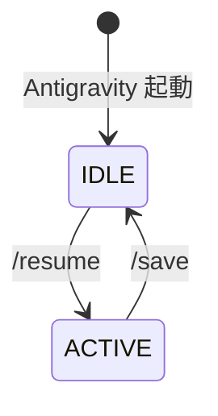
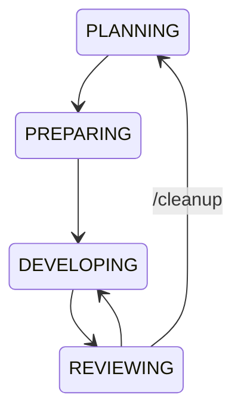
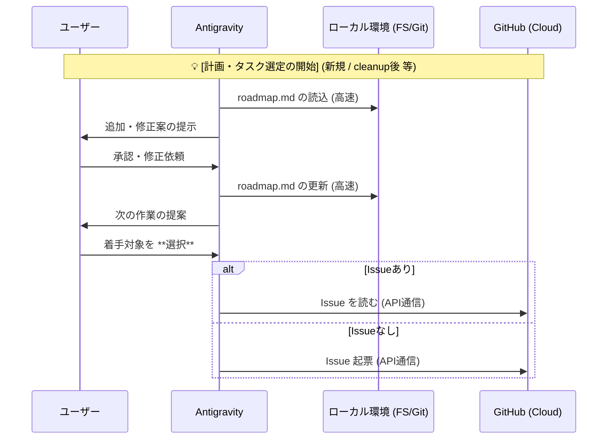
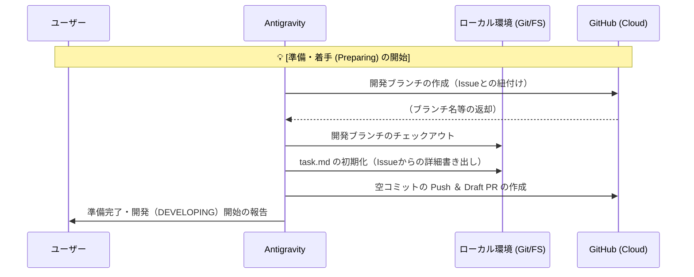
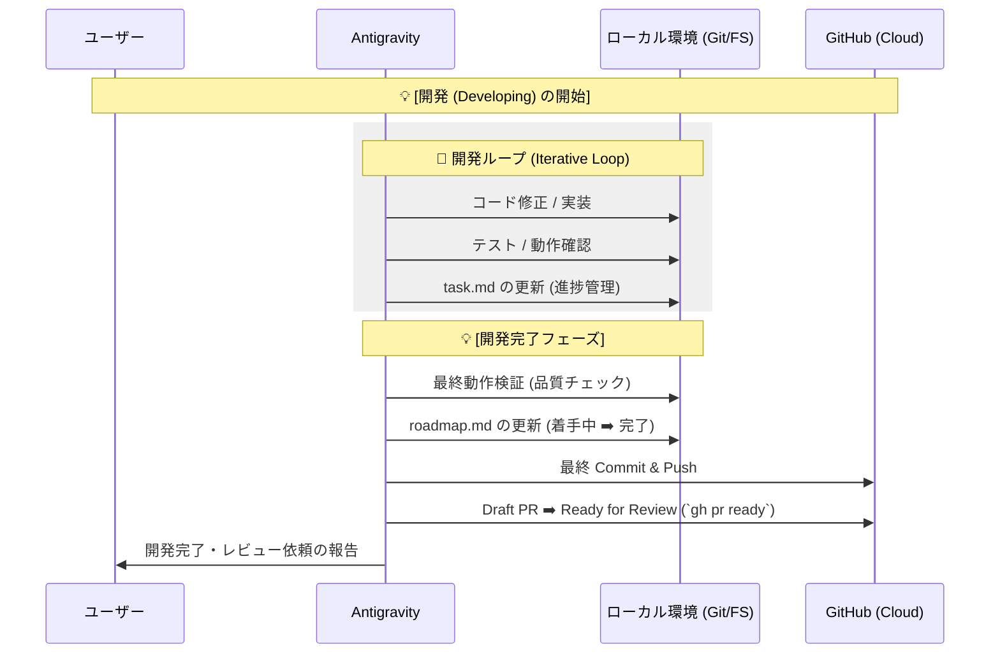
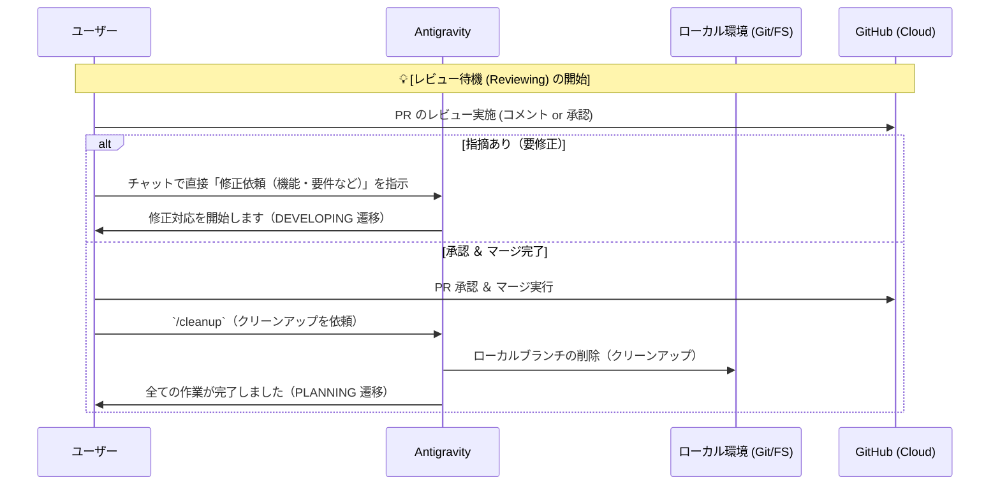
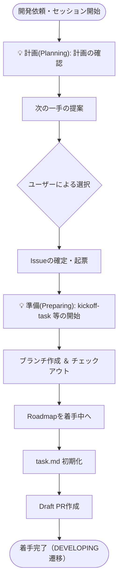
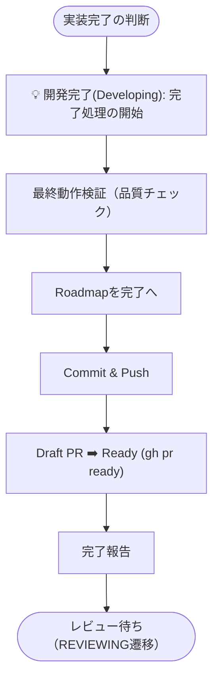

# 開発ワークフロー設計書 (Development Workflow Design)

本リポジトリにおける開発のライフサイクル、AI Skill の役割、およびコンテキスト継続性の設計思想を定義します。

## 1. 設計上の重要原則

1. **GitHub Issue as the Source of Truth**: 設計判断やタスクリストの詳細は常に Issue に集約され、AI の `task.md` はその一時的な写しに過ぎません。
2. **Early Draft PR**: コードの透明性を保つため、最初の Commit 直後に Draft PR を作成します。
3. **Skill-Driven Execution**: 複雑な手順や定型作業は Skill (`SKILL.md` ＋ スクリプト) にカプセル化し、実行時の安定性と強制力を担保します。
   - **Skill化すべき領域（Mechanical / 定型・確定性）**:
     - **PREPARING (準備・着手)**: `kickoff-task`（ブランチ作成、`task.md`初期化、Draft PR）など、命名規則やテンプレートの強制が必須な領域
     - **DEVELOPING (完了フロー)**: `wrapup-task`（最終動作検証、Roadmap更新、PR Ready化）など、品質・監査証跡を遵守すべき領域
     - **REVIEWING (クリーンアップ)**: `/cleanup`（マージ済みローカルブランチの安全な削除、メインブランチへの退避、一時ファイル削除など、事故の起きやすい終了処理の自動化）
     - **状態同期 (`/save`, `/resume`)**: セーブデータのデータ構造（スナップショット）の完全性・パースの確実性を保証すべき領域
   - **AIの自律・対話に委ねる領域（Intelligence / 柔軟性）**:
     - **PLANNING (計画)**: チャットでの高度な意見交換や、アイデアの発想・設計のすり合わせ
     - **DEVELOPING (実装ループ)**: ツールを駆使した自由な試行錯誤やデバッグ（固定フローで縛ると柔軟性が落ちるため）
   - **運用のハイブリッドモデル**:
     - **明示的呼び出し**: ユーザーがコマンド（`/save` 等）で直接指示する（人間の作業時短用）
     - **自律的呼び出し**: AIが文脈を判断し、自らガイドレール（安全装置）として Skill をロードして確実に実行する
4. **Local-First Context with GitHub Backup**: 作業中の進捗（サブ状態）はローカル（`task.md`）で高速管理し、GitHub へのコメント（Checkpoint）は状態の大きな遷移時や `/save`（中断）の同期ポイントのみへ最小化します。これにより、実用的な応答速度と確実なバックアップ（Source of Truth）を両立させます。
5. **Audit Trail for Direct Feedback**: ユーザーからチャットで直接受けた修正指示であっても、AIは実装・Push時にその修正理由（ユーザーからの指摘内容）を PR にコメントとして記録します。これにより、後から履歴を追う際の透明性を高めます。

## 2. 状態遷移

### 1-1. IDLE - ACTIVE 状態

- 状態
  - `IDLE`: 起動直後の、コンテキストが失われた状態
  - `ACTIVE`: コンテキストが継続している状態
- アクション
  - `/resume`: 中断状態から作業を再開する
  - `/save`: 作業を中断し、進捗を保存する 

### 1-2. ACTIVE 状態

- ACTIVE 状態は大きく以下の 4 状態を遷移する
- `/resume` 時に、4 状態のどこから再開するかを判断し、そこから再開する

- `PLANNING`: タスクリストを管理し、次の作業を決める
- `PREPARING`: 次の作業を開始するための準備を行う
- `DEVELOPING`: 開発を行う
- `REVIEWING`: PR を発行し、ユーザーによるレビューを受ける

### 1-3. PLANNING 状態（計画・タスク選定シーケンス）

- 目的
  - 次にするタスク（Issue）を確定させる
- 注記
  - `/resume` 実行時は、直前のチェックポイント（Checkpoint）に応じて各状態（Developing等）に直接復帰することもありますが、本図は **Planning から再開（または新規計画）時の流れ** を示します。

### 1-4. PREPARING 状態

- 目的
  - 実装作業（DEVELOPING）へスムーズに移行するための環境を整える

### 1-5. DEVELOPING 状態

- 目的
  - Issue の要件を満たす実装を完成させ、レビューを依頼する

### 1-6. REVIEWING 状態

- 目的
  - ユーザーのレビューを受け、指摘対応またはクリーンアップを行う

## 3. 詳細実行フロー（Skill手順）

### 3-1. 着手フロー (Kickoff Flow)

`kickoff-task` Skill 等が担う、作業開始時の詳細な論理手順です。

### 3-2. 完了フロー (Wrapup Flow)

`wrapup-task` Skill 等が担う、品質確保と最終化の詳細な手順です。

